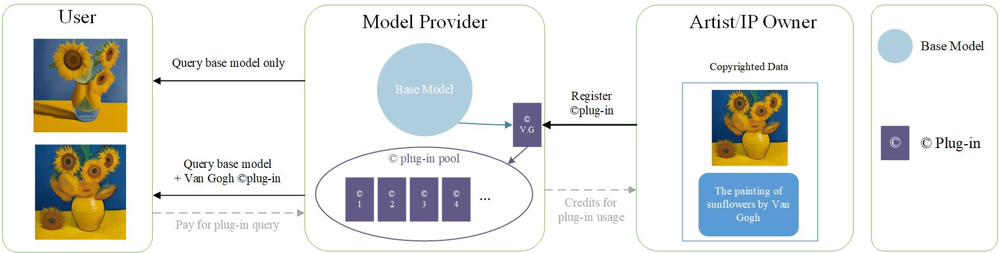
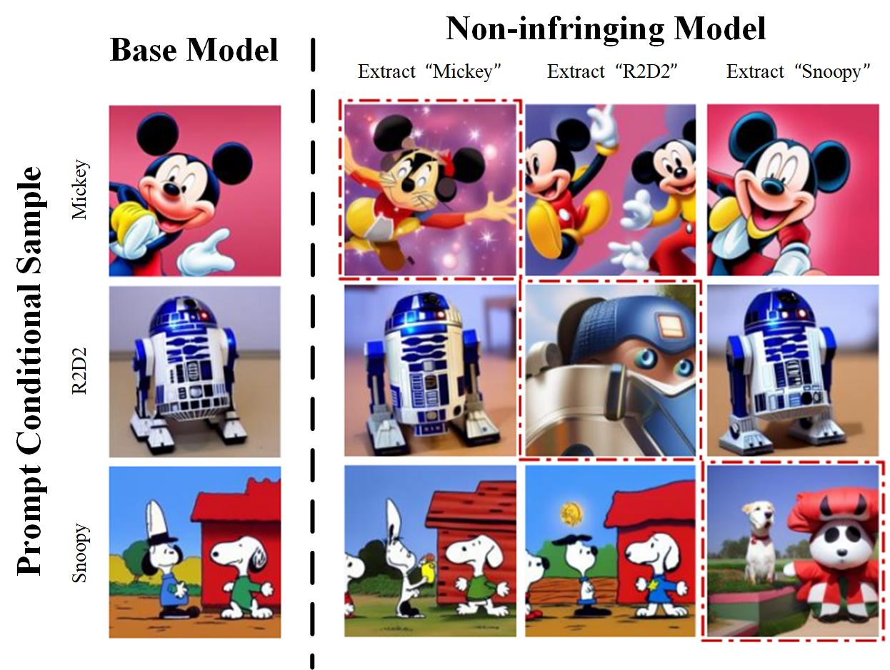

# \Copyright Plug-in Authorization for Human Content Copyright Protection in Text-to-Image Model (TMLR2025)

This repository contains the official implementation of the paper [\Copyright Plug-in Authorization for Human Content Copyright Protection in Text-to-Image Model](https://arxiv.org/abs/2404.11962)

## Framework



The authorization process consists of three types of entities: user, model provider, and IP owners (artists). Users can generate copyrighted images only by accessing the relevant plug-in.  The model provider offers services to users, tracks usage of plug-ins, and attributes rewards to the IP owner. The IP owners can achieve authorization by registering their \copyright plug-ins through __addition__ or __extraction__. These \copyright plug-ins form a pool where users can get \copyright plug-ins to produce content with the IP owner's authorization.

## Visualization Results 


Each column on the right represents the output of a distinct non-infringing model. We successfully extract the unique IPs of Mickey, R2D2, and Vader independently, preserving the generation of other IPs.

## Quick Start

```
pip install -r requirements.txt
```
**Warming: the configurations have been written in the source code. You can modify the source code can be modified as needed when reproducing.**

### LoRA Training
Prepare some images and captions. Then, run the command. 
```
python src/train_unet_lora.py
```

### Lora inference
run the command 
```
python src/sample_lora.py
```

### Lora Merge

run the command
```
python src/multi_lora_combine.py
```